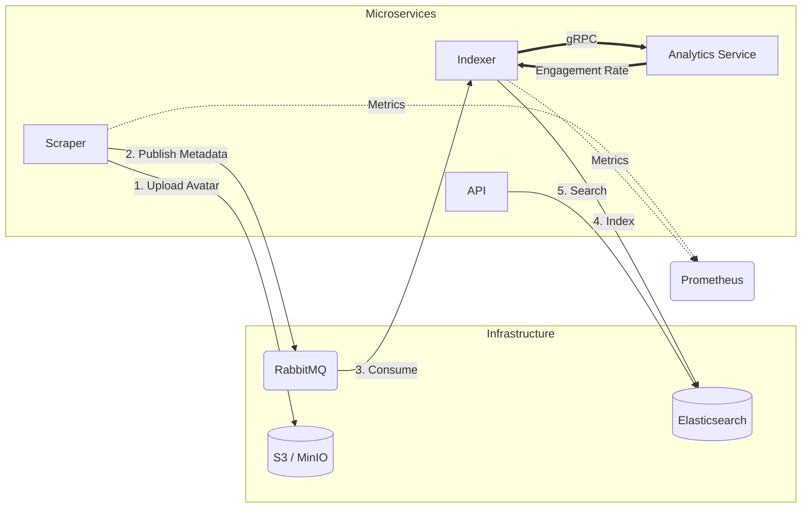
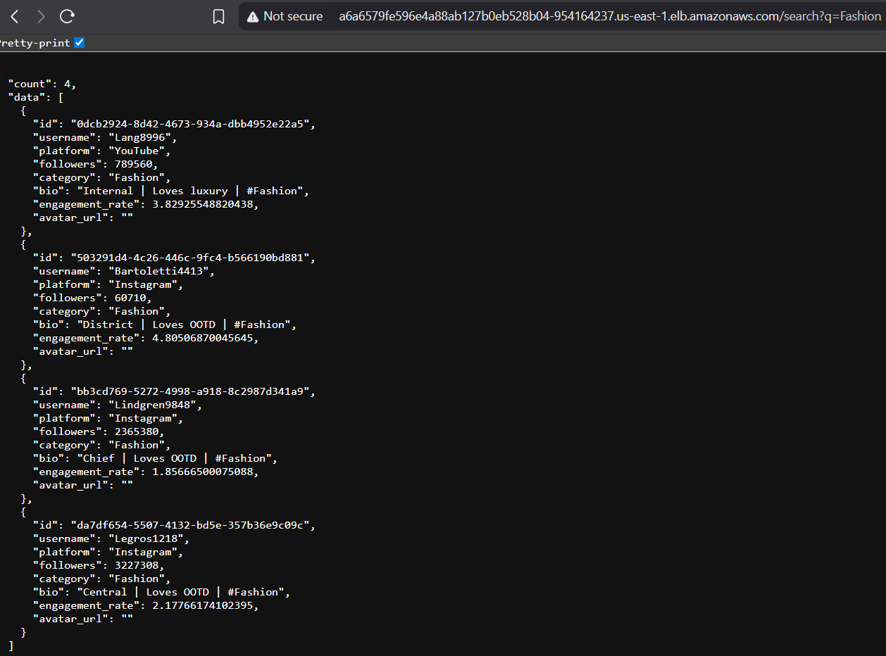
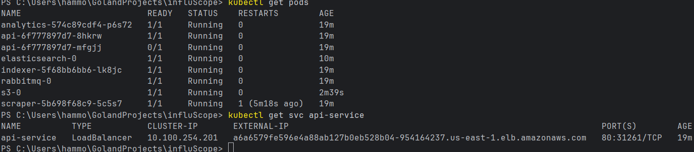

# InfluScope

**A distributed influencer discovery and search platform designed with an event-driven microservices architecture.**

InfluScope mimics a production-grade ingestion pipeline. It decouples data discovery (scraping) from data indexing using a message broker, while utilizing synchronous RPC for real-time data enrichment. The system is designed to run on a production-grade Kubernetes cluster hosted on AWS (Amazon EKS), utilizing cloud-native patterns for storage, networking, and orchestration.

---

## Architecture Overview

The system follows a hybrid communication pattern to ensure high throughput and low latency:

- **Asynchronous (Event-Driven)**: RabbitMQ handles high-throughput ingestion from the Scraper.
- **Synchronous (RPC)**: gRPC handles low-latency computation between the Indexer and Analytics service.



## Data Flow

**Public Traffic**: Enters via the AWS Load Balancer (Port 80) -> Kubernetes Service -> API Pod (Port 8080).

**Internal Communication**:

- **Async**: Scraper uploads avatars to S3 (MinIO) and publishes metadata to RabbitMQ.
- **Sync**: Indexer consumes messages, calls the Analytics Service via gRPC to calculate metrics (e.g., Engagement Rate).

**Persistence**: Indexer persists enriched data to Elasticsearch. RabbitMQ and Elasticsearch utilize persistent block storage (EBS) to ensure data survival.

## Microservices

- **Scraper**: Generates smart influencer profiles and implements "self-healing" logic to initialize storage buckets automatically.
- **Indexer**: Orchestrates data enrichment and performs bulk indexing operations into Elasticsearch.
- **Analytics Service**: A dedicated gRPC microservice that calculates complex derived metrics based on platform algorithms.
- **API**: A lightweight HTTP gateway that translates user search queries into Elasticsearch DSL.
- **MinIO (S3)**: Provides S3-compatible object storage for static assets.
- **Prometheus**: Aggregates metrics to visualize system throughput.

##  Tech Stack

- **Language**: Go (Golang) 1.25
- **Orchestration**: Kubernetes (AWS EKS)
- **Messaging**: RabbitMQ
- **RPC Framework**: gRPC (Protobuf)
- **Search Engine**: Elasticsearch 7.17
- **Object Storage**: AWS S3 / MinIO
- **Observability**: Prometheus
- **CI/CD**: GitHub Actions & GHCR
- **Infrastructure as Code**: eksctl & CloudFormation

## Getting Started (Local Development)

To run the full stack locally using Docker Compose:

### Prerequisites

- Docker Desktop
- Go 1.25+
- Make (Optional)

### Steps

1. **Start Services**:

```bash
make up
# Or: docker-compose up --build
```

2. **Run Tests**:

```bash
make test
```

3. **Verify Status**:

- **Search API**: http://localhost:8080/search?q=tech
- **MinIO Console**: http://localhost:9001 (User: admin / Pass: password)
- **RabbitMQ**: http://localhost:15672 (guest/guest)

##  Cloud Deployment (AWS EKS)

The system is deployed on AWS Elastic Kubernetes Service (EKS) to simulate a real-world high-availability environment.

### Infrastructure Components

- **Region**: us-east-1
- **Compute**: Managed Node Group (2x t3.small instances, Amazon Linux 2).
- **Storage**: AWS EBS GP3 volumes via EBS CSI Driver.
- **Networking**: AWS Classic Load Balancer (CLB) exposing the API.

### Prerequisites for Deployment

- AWS CLI (`aws configure`)
- `eksctl`
- `kubectl`

### Deployment Instructions

**1. Provision Infrastructure**
Create the EKS cluster (approx. 15-20 mins).

```bash
eksctl create cluster -f cluster-config.yaml
```

**2. Apply ConfigMap**
Apply environment variables and credentials.

```bash
kubectl apply -f k8s/00-config.yaml
```

**3. Deploy Stateful Services**
Deploy Elasticsearch, RabbitMQ, and MinIO. Wait 60s for EBS volumes to attach.

```bash
kubectl apply -f k8s/01-infrastructure.yaml
```

**4. Deploy Microservices**
Deploy API, Scraper, Indexer, and Analytics.

```bash
kubectl apply -f k8s/02-apps.yaml
```

**5. Verification**
Retrieve the Load Balancer URL:

```bash
kubectl get svc api-service
```

Test the endpoint:

```
http://<EXTERNAL-IP>/search?q=tech
```

### Live Deployment Evidence
<p align="center"> 


<em>Live API Response from AWS Load Balancer</em> </p>

<p align="center"> 


<em>Live pods running and API external IP address</em> </p>

### Teardown

To stop billing and remove all AWS resources:

```bash
eksctl delete cluster -f cluster-config.yaml
```

## Design Decisions

### Why Kubernetes (EKS)?

To align with the target architecture of modern tech companies. Using EKS demonstrates the ability to manage managed control planes and worker nodes rather than simple Docker containers.

### Why StatefulSets?

RabbitMQ and Elasticsearch require stable network identities and persistent storage. Deploying them as StatefulSets ensures that if a pod crashes, it reconnects to the same EBS volume, preventing data loss.

### Hybrid Communication Strategy

- **RabbitMQ (Async)**: Used for the ingestion pipeline to prevent backpressure. If the Indexer slows down, the Scraper can keep working without crashing the system.
- **gRPC (Sync)**: Used for the Analytics Service. We chose gRPC over REST for strict type safety (Protobuf) and lower latency, as this calculation happens inside the critical indexing loop.

### Hybrid Storage Pattern (AWS SAA)

Following AWS Well-Architected Framework best practices, I decoupled storage:

- **Structured Data**: Stored in Elasticsearch for low-latency indexing/search.
- **Unstructured Data**: Profile images offloaded to S3 to reduce database bloat and leverage cost-effective tiered storage.

## Performance & Observability

### Benchmarks (k6)

- **Scenario**: 50 concurrent users performing continuous search queries.
- **Result**: 100% Success Rate.
- **Latency**: Average response time of 6.04ms (p95: 9.18ms).
- **Throughput**: ~40 req/s on local hardware.

### CI/CD Pipeline

This project uses GitHub Actions. On every push to main:

- Dependencies are verified.
- Tests are executed.
- Binaries are compiled.
- Optimized Docker images are pushed to GitHub Container Registry (GHCR).

## License
MIT