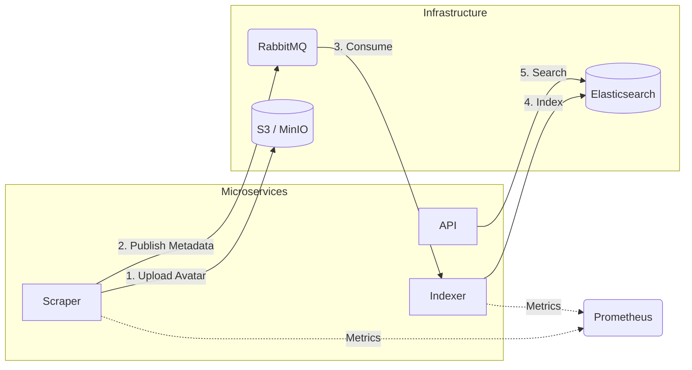

# InfluScope

A distributed influencer discovery and search platform designed with an event-driven microservices architecture.

## Overview

InfluScope mimics a production-grade ingestion pipeline. It decouples data discovery (scraping) from data indexing using a message broker, ensuring system resilience and scalability. The system allows users to search for influencers based on bio keywords, categories, and usernames via a REST API, while providing real-time metrics on data throughput.

## Architecture

The system follows a writer/reader pattern decoupled by RabbitMQ. A sidecar Prometheus instance scrapes metrics from all microservices.



## Services

* **Scraper:** Generates influencer profiles and publishes events to the `influencer-events` exchange. Exposes ingestion metrics on `:8081/metrics`.
* **Indexer:** Consumes messages from the queue and performs bulk indexing operations into Elasticsearch. Exposes indexing counters and error rates on `:8082/metrics`.
* **API:** A lightweight HTTP gateway that translates user search queries into Elasticsearch DSL.
* **Prometheus:** Aggregates metrics from the Scraper and Indexer to visualize system throughput and bottlenecks.

## Tech Stack

* **Language:** Go (Golang) 1.25
* **Messaging:** RabbitMQ (utilizing `upfluence/amqp` for connection pooling)
* **Search Engine:** Elasticsearch 7.17
* **Observability:** Prometheus
* **Orchestration:** Kubernetes (Manifests included)
* **CI/CD:** GitHub Actions (Automated testing & build)
* **Automation:** GNU Make

## Design Decisions

* **Decoupling:** RabbitMQ is used to separate the scraping logic from the indexing logic. This prevents data loss if the search engine is under heavy load; messages simply accumulate in the queue.
* **Observability:** Custom Prometheus instrumentation tracks `influencers_discovered_total` vs `influencers_indexed_total`, allowing for immediate detection of pipeline latency or dropped messages.
* **Resilience:** Services implement application-level retry logic with exponential backoff to handle infrastructure startup latency and temporary network partitions.
* **Production Readiness:** Includes a `k8s/` directory with separated ConfigMaps, StatefulSets (Infrastructure), and Deployments (Apps) to mimic a real cluster setup.

## Quick Start

### Prerequisites

* Docker Desktop
* Go 1.25+ (for local development)
* Make (Optional, for automation)

### Running the Stack

1.  **Clone the repository**
    ```bash
    git clone [https://github.com/hammo/influScope.git](https://github.com/hammo/influScope.git)
    cd influScope
    ```

2.  **Start Services (Automated)**
    ```bash
    make up
    ```
    *(Or manually: `docker-compose up --build`)*

3.  **Run Tests**
    ```bash
    make test
    ```

4.  **Verify Status**
    * **Search API:** `http://localhost:8080/search?q=tech`
    * **RabbitMQ Dashboard:** `http://localhost:15672` (guest/guest)
    * **Prometheus Dashboard:** `http://localhost:9090`

## Performance Benchmarks

To ensure scalability, the system was load-tested using **k6**.

* **Scenario:** 50 concurrent users (Virtual Users) performing continuous search queries.
* **Result:** 100% Success Rate (0 Failed Requests).
* **Latency:** Average response time of **6.04ms** (p95: 9.18ms).
* **Throughput:** ~40 req/s on local hardware.
### Observability

To verify the pipeline health, open Prometheus (`http://localhost:9090`) and query the custom metrics:

* `influencers_discovered_total` (Scraper output)
* `influencers_indexed_total` (Indexer throughput)

*If "Discovered" > "Indexed", the queue is building backpressure.*

## Kubernetes Deployment

This project includes production-ready Kubernetes manifests in the `k8s/` directory.

```bash
# Deploy to local cluster
kubectl apply -f k8s/00-config.yaml
kubectl apply -f k8s/01-infrastructure.yaml
kubectl apply -f k8s/02-apps.yaml
```


## CI/CD Pipeline

This project uses **GitHub Actions** to enforce code quality. On every push to `main`:
1.  Dependencies are verified (`go mod download`).
2.  All microservices (Scraper, Indexer, API) are built in parallel to ensure no breaking changes were introduced.
## License

MIT
